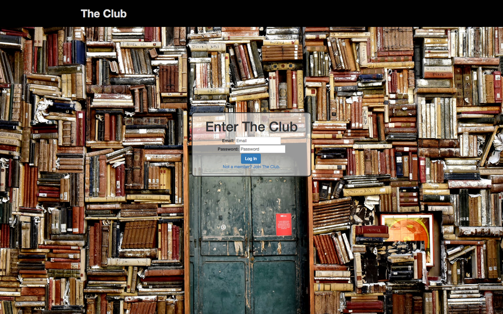
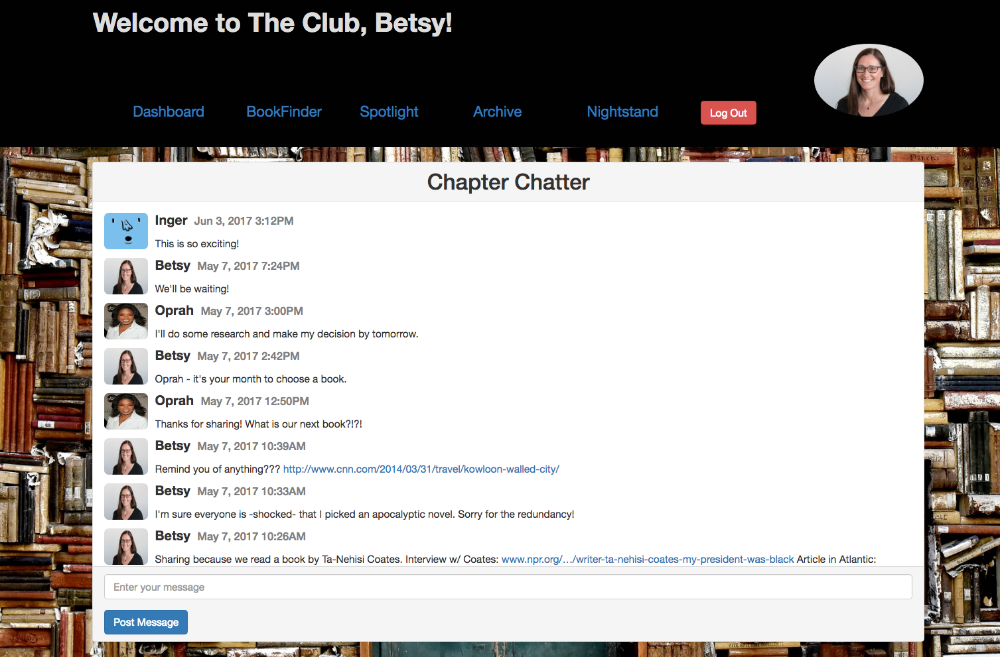
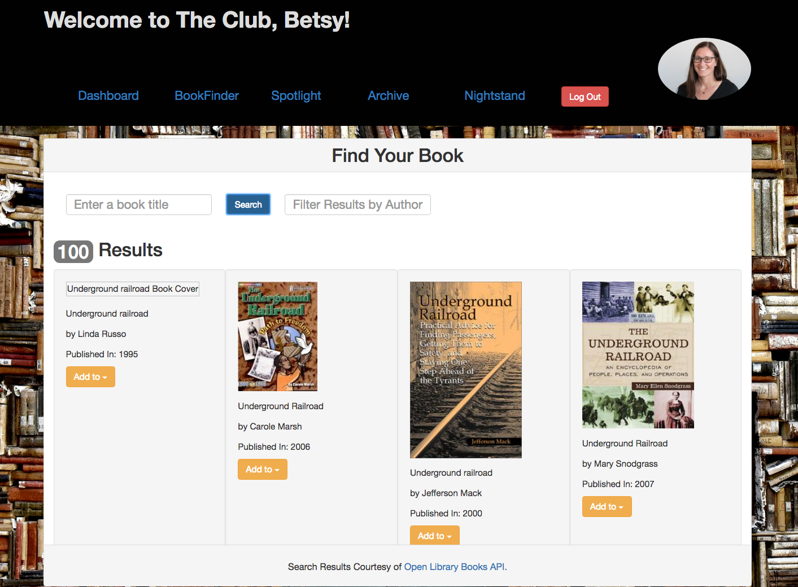
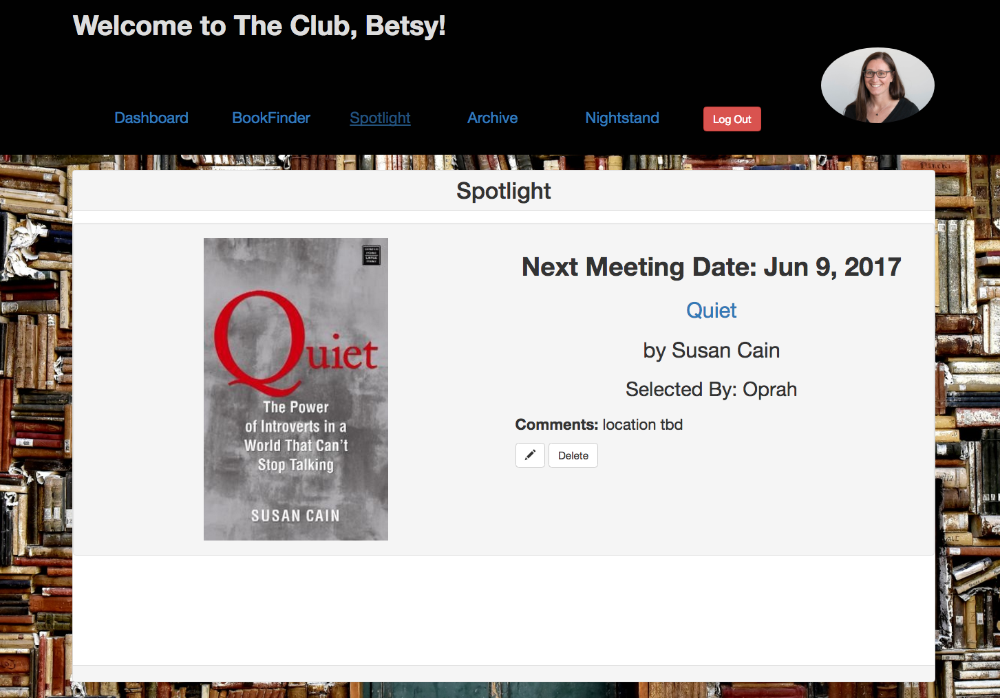
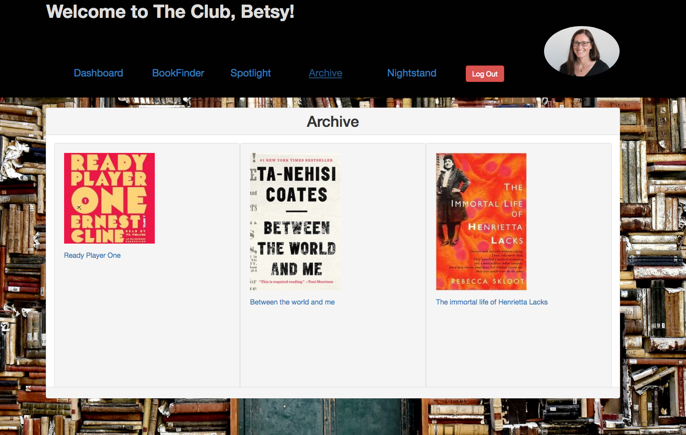

# The Club



The Club is a full-stack web application that serves as a social platform for book clubs. It creates a central location for club members to communicate, as well as track current and past books they have read.

Upon logging in, each member will be able to share thoughts, articles, events, videos and resources with other members via the message board.

Additionally, all members will have the same view of the featured current book that the group has selected and the Archive of all past books that have been read and discussed.

Individually, members will be able to add other books of interest to their personal “Night Stand”. These books could be recommendations received from other members or books they have come across that they might want to chose when it is their turn to select the book.

## Application Features

### * Message Board



### * Book Search with results from Open Library Books api



### * Spotlight (Featured Book of the Month)



### * Archive (All books read and discussed by the club)




## Getting Started

These instructions will get you a copy of the project up and running on your local machine for development and testing purposes. See deployment for notes on how to deploy the project on a live system.

### Prerequisites

What things you need to install the software and how to install them

```
Give examples
```

### Installing

A step by step series of examples that tell you have to get a development env running

Say what the step will be

```
Give the example
```

And repeat

```
until finished
```

End with an example of getting some data out of the system or using it for a little demo

## Built With

* PostgreSql
* Express.js
* AngularJS
* Node.js
* Grunt
* HTML5
* CSS3
* Bootstrap
* Heroku
* Heroku Postgres
* Passport.js
* [Open Library Books API](https://openlibrary.org/dev/docs/api/books)

## Documentation

[Scope Document](https://docs.google.com/document/d/1ak0J5unG9HHWWuefwKQ6NKXOXi7Oth97aYg4_sPRnNc/edit?usp=sharing).

## Authors

* [**Betsy Rowley**](https://github.com/BetsyRowley)

## Acknowledgments

* Prime Digital Academy Instructor Kris Dszafranski for providing the Passport Code Base.
* Prime Digital Academy Instructors Chris Black, Scott Bromander, and Luke Schlangen for their on-going support.
* Center for Ants Book Club for their love of books and inspiration.
